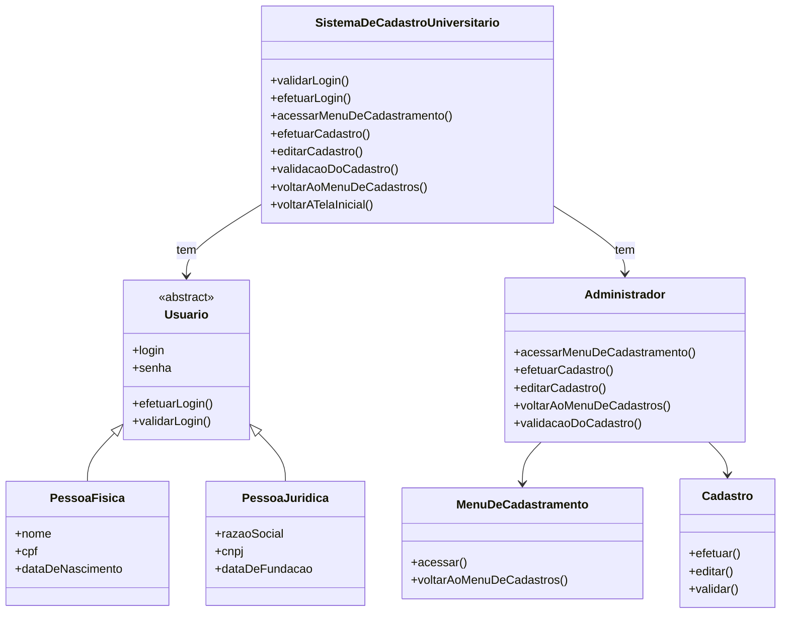
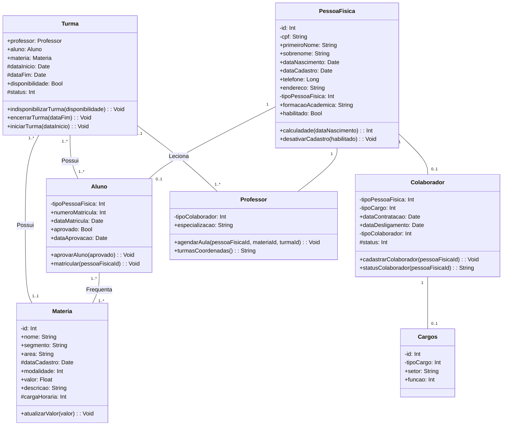

<h1 align="center">Senac EAD - Análise e Desenvolvimento de Sistemas</h1>
 
<h2 align="center">Projeto Integrador: Desenvolvimento de Sistemas Orientado a Objetos.</h2>
 
Integrantes:
 
- Andrew Matos Ascar
 
- Humberto Moura Dos Anjos Junior
 
- Italo Da Silva Barbosa
 
- Jhonatan Bruno Ostroski

# Proposta do Projeto:

O projeto consiste no processo de modelagem de um sistema voltado a gestão de dados de um centro universitário **O projeto foi executado em duas etapas, listadas abaixo:**

## Primeira Entrega:

Desenvolvimento do diagrama de casos de uso representando os cenários referente ao sistema, composto pelas seguintes partes:

-   Pessoa Física;
-   Pessoa Jurídica;
-   Professores;
-   Fornecedores;
-   Alunos;

Descrição dos cenários dos casos de uso construídos, levando em consideração um cenário principal, dois cenários alternativos, pré-condições e pós-condições.

Previsto também a elaboração de um diagrama de classe, de acordo com a proposta do projeto; Foi utilizado a linguagem Mermaid, para representar os diagramas de classes UML e digrama de casos de uso.
 

Diagrama de Casos de Uso:
 

 
Diagrama de Classe UML:
 

## Segunda Entrega:

É composta pela prototipação (interface do sistema) do que foi realizado na primeira parte do projeto. Os protótipos contemplam as seguintes interfaces:

[Cadastro de Pessoa Física](https://github.com/jbostroski/PTI-Senac-Grupo40/blob/main/pessoa_fisica.png)
 
[Cadastro de Pessoa Jurídica](https://github.com/jbostroski/PTI-Senac-Grupo40/blob/main/pessoa_juridica.png)
 
[Cadastro de Professores](https://github.com/jbostroski/PTI-Senac-Grupo40/blob/main/professor.png)
 
[Cadastro de Fornecedores](https://github.com/jbostroski/PTI-Senac-Grupo40/blob/main/fornecedores.png)
 
[Cadastro de Alunos](https://github.com/jbostroski/PTI-Senac-Grupo40/blob/main/alunos.png)

Os protótipos foram desenvolvidos utilizando a ferramenta Figma. 

**Os arquivos foram reunidos neste repositório.**
